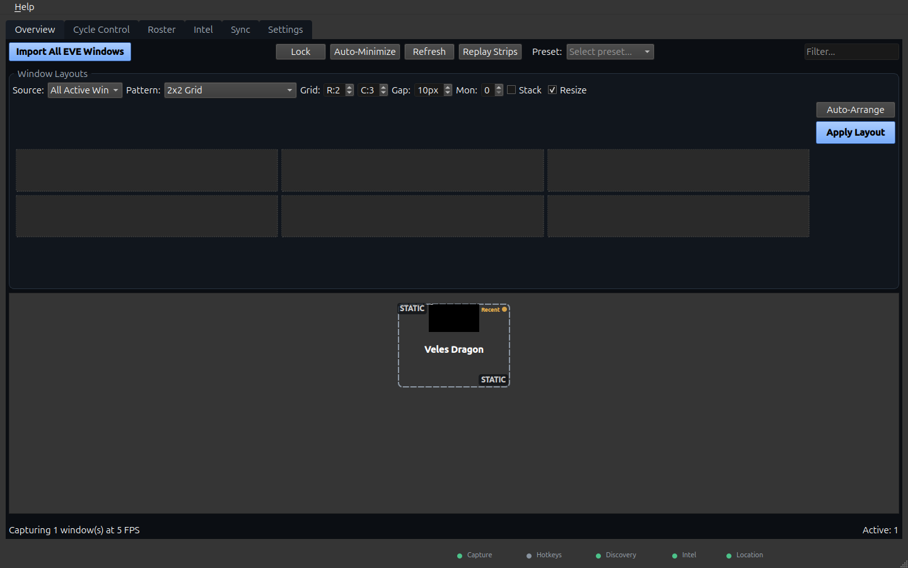
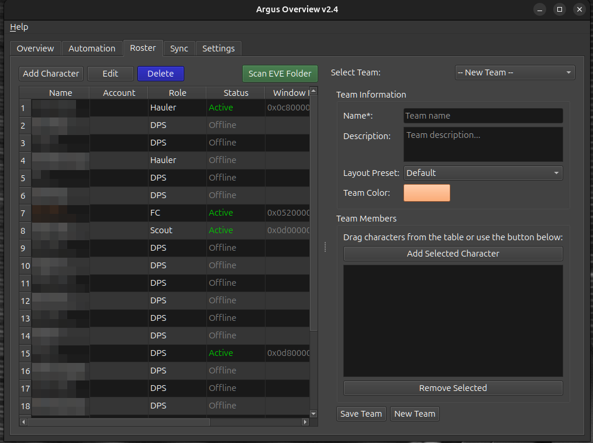
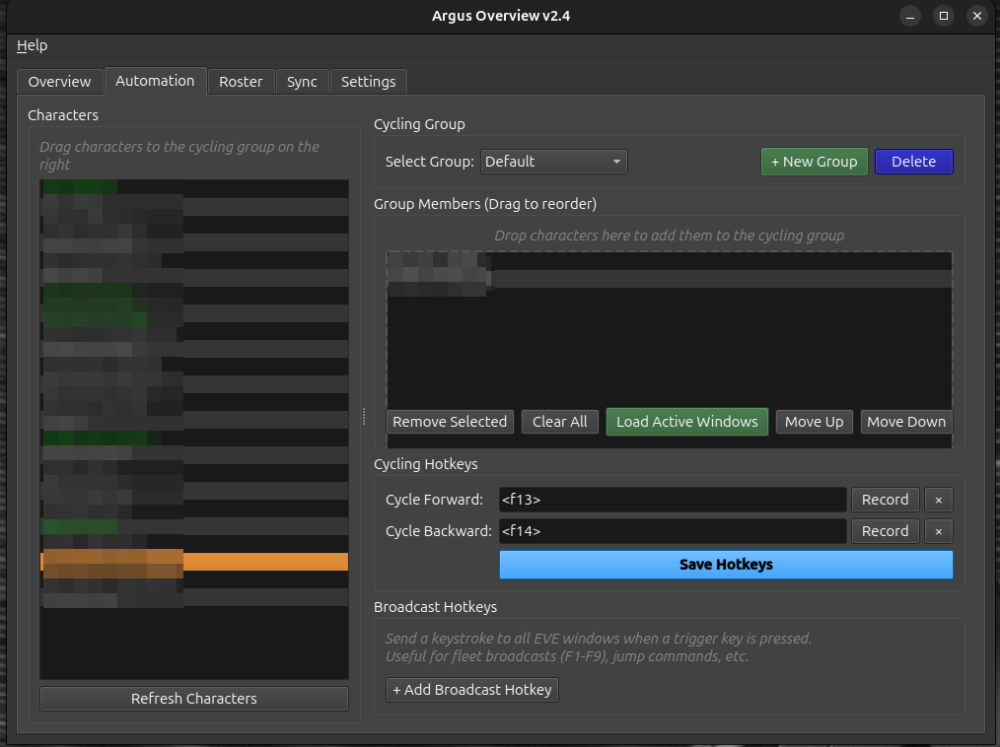
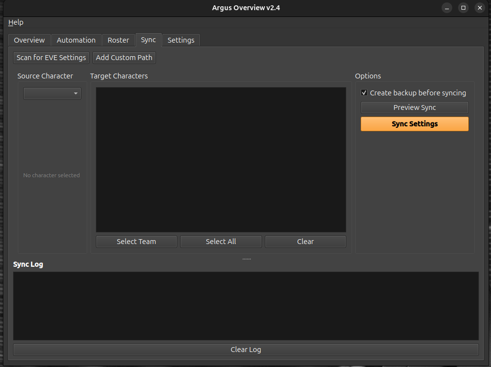
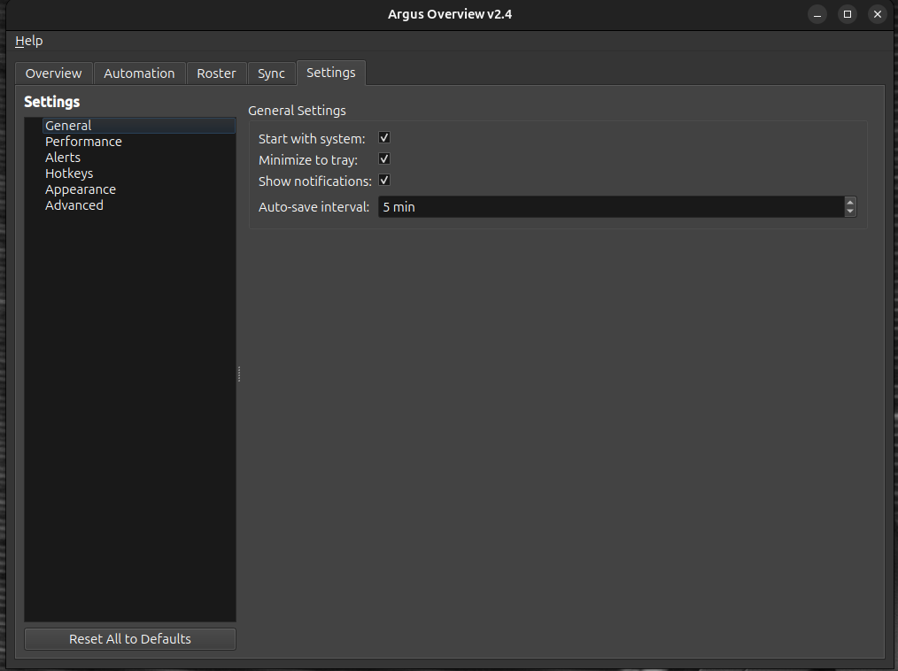

# Argus Overview v3.2.0

**The Complete Professional Multi-Boxing Solution for EVE Online**

[](https://pypi.org/project/argus-overview/)
[](https://pypi.org/project/argus-overview/)
[](https://github.com/AreteDriver/Argus_Overview/actions)
[](LICENSE)
[]()
[](https://github.com/AreteDriver/Argus_Overview/releases)

## Quick Install

**Linux (pip):**
```bash
pip install argus-overview
argus-overview
```

**Linux (portable — no install):**
```bash
# Download from https://github.com/AreteDriver/Argus_Overview/releases
tar -xzf Argus-Overview-*-Linux.tar.gz && cd argus-overview-linux
./run.sh
```

**Windows:** Download the `.exe` from [Releases](https://github.com/AreteDriver/Argus_Overview/releases) and run it.

**1,875 tests · 96% coverage · 2,500+ downloads**

> Cross-platform support (Windows native, Mac) planned for v3. Community interest in Qt/Rust port welcome — see [CONTRIBUTING.md](CONTRIBUTING.md).

---

## Screenshots

### Overview Tab
Window preview management with grid layouts and auto-arrange.


### Roster Tab
Character management with roles, status, and team organization.


### Cycle Control Tab
Cycling groups with hotkey recording.


### Sync Tab
EVE settings synchronization between characters.


### Settings Tab
General settings with auto-save and notifications.


---

## Platform Support

| Platform | Status | Download |
|----------|--------|----------|
| **Linux** | Full-featured native application | [Portable Tarball / AppImage](https://github.com/AreteDriver/Argus_Overview/releases) |
| **Windows** | Full-featured native application | [Windows .exe](https://github.com/AreteDriver/Argus_Overview/releases) |

- **Linux**: X11/XWayland support with native tools (xdotool, wmctrl). **Portable tarball** runs directly after unpacking.
- **Windows**: Native Win32 API implementation. No external tools required.

## ☕ Support Development

If you find Argus Overview useful, consider supporting development:

- **In-Game**: Send ISK donations to **AreteDriver** in EVE Online
- **Buy Me a Coffee**: [buymeacoffee.com/aretedriver](https://buymeacoffee.com/aretedriver)

Your support helps keep this project maintained and improving! o7

---

## 🌟 **v3.0 - Unified Cross-Platform Release**

One codebase for both Linux and Windows!

### New in v3.0:
- **Unified Codebase** - Single repository supporting both Linux and Windows
- **Platform Abstraction Layer** - Clean separation of platform-specific code
- **Native Win32 API** - Full Windows support using native APIs (pywin32)
- **Improved Architecture** - Better testability and maintainability
- **All v2.9 Features** - Intel parser, settings sync, and more

---

## Previous Releases

<details>
<summary><strong>v2.9 Intel Channel Parser</strong></summary>

Monitor your intel channels and stay safe in null-sec!

### New in v2.9:
- **Intel Tab** - New tab for monitoring EVE chat logs
- **System Detection** - Recognizes null-sec system names (HED-GP, 1DQ1-A, etc.)
- **Ship Recognition** - Identifies 100+ EVE ship types including capitals
- **Hostile Counts** - Parses counts (+5, x10, gang of 20, etc.)
- **Threat Assessment** - Five levels from clear to critical
- **Configurable Alerts** - Set thresholds and cooldowns
- **Auto Log Detection** - Finds EVE logs in native and Proton installs

</details>

<details>
<summary><strong>v2.8 CCP Fair Play Compliance</strong></summary>

This release ensures **full compliance with CCP's EULA and Fair Play Policy**.

### Changes in v2.8:
- **Removed Visual Alerts** - Red flash detection feature removed for EULA compliance
- **Tab Rename** - "Automation" tab renamed to "Cycle Control" for clarity
- **Documentation Updates** - All docs updated for consistency

</details>

<details>
<summary><strong>v2.7 Performance Edition</strong></summary>

This release focused on **performance optimization and security hardening**.

### ✅ **NEW in v2.7:**

#### 1. **Preview Filter** ⭐⭐⭐⭐
- Quick search box in Overview toolbar
- Type to filter visible windows by character name
- Status bar shows filtered count

#### 2. **Keyboard Window Control** ⭐⭐⭐
- Number keys 1-9 activate windows by position
- Works when Overview tab is focused
- Quick direct access to specific windows

#### 3. **Performance Optimizations** ⭐⭐⭐⭐⭐
- Fixed CPU busy loop (15-20% CPU reduction)
- Fixed memory leak (~600x memory reduction per window)
- Added wmctrl result caching (1-second TTL)
- Fixed O(n²) duplicate detection in hotkey groups

#### 4. **Security Hardening** ⭐⭐⭐
- Window ID validation on all subprocess calls
- Path traversal prevention in layout manager
- Narrowed exception handlers to specific types

</details>

<details>
<summary><strong>v2.6 Performance & Layout Edition</strong></summary>

This release focuses on **performance optimization and layout management** for running multiple EVE clients smoothly!

### ✅ **NEW in v2.6:**

#### 1. **Low Power Mode** ⭐⭐⭐⭐⭐
- Reduces FPS to 5
- Perfect for running with EVE clients open
- Minimizes GPU/CPU usage while maintaining functionality

#### 2. **Auto-Minimize Inactive** ⭐⭐⭐⭐⭐
- Automatically minimizes previous window when cycling
- Works with preview clicks, F13/F14 hotkeys, and per-character hotkeys
- Persistent toggle in Settings > Performance

#### 3. **Disable Previews** ⭐⭐⭐⭐
- Option to stop capture loop entirely
- Maximum GPU savings - window cycling still works
- Enable when you only need hotkey switching

#### 4. **Drag-Drop Layout** ⭐⭐⭐⭐
- Drag windows from preview area to arrangement grid
- Visual placement before applying layout
- Works with all grid patterns (2x2, 3x1, etc.)

#### 5. **HotkeyEdit Widget** ⭐⭐⭐
- Click "Record" then press any key to set hotkeys
- Supports F13/F14 for G13 integration
- No more manual text entry

</details>

<details>
<summary><strong>v2.2 Ultimate Edition - Major UX Overhaul</strong></summary>

This release focused on **usability, automation, and polish** with 14 new features!

### ✅ **NEW in v2.2:**

#### 1. **System Tray Integration** ⭐⭐⭐⭐⭐
- Orange "V" icon in system tray
- Minimize to tray instead of closing
- Quick access menu (Show/Hide, Profiles, Settings)
- Double-click to show/hide main window
- Notifications for new characters

#### 2. **One-Click Import** ⭐⭐⭐⭐⭐
- Scan and import ALL EVE windows with one button
- Automatically detects character names from window titles
- Skip duplicates automatically
- Shows count of imported characters

#### 3. **Auto-Discovery** ⭐⭐⭐⭐⭐
- Background process scans every 5 seconds (configurable)
- Automatically adds new EVE windows when they launch
- Shows notification for each new character
- No more manual adding required!

#### 4. **Per-Character Hotkeys** ⭐⭐⭐⭐
- Bind Ctrl+1 to "Main Character", Ctrl+2 to "Scout Alt"
- Global hotkeys work even when EVE has focus
- Configure in settings.json

#### 5. **Position Lock** ⭐⭐⭐⭐
- Lock thumbnail positions to prevent accidental moves
- Lock button in toolbar + Ctrl+Shift+L hotkey
- Visual lock icon on thumbnails when locked

#### 6. **Custom Labels** ⭐⭐⭐⭐
- Right-click thumbnail → "Set Label..."
- Display "Scout", "Logi", "DPS" instead of character names
- Persists across sessions

#### 7. **Hover Effects** ⭐⭐⭐
- Opacity fade on hover (30% default, configurable)
- See through thumbnails to underlying windows
- Smooth transitions

#### 8. **Activity Indicators** ⭐⭐⭐
- Small colored dot on each thumbnail
- Green = focused, Yellow = recent activity, Gray = idle
- Quickly identify active windows

#### 9. **Session Timers** ⭐⭐⭐
- Optional "2h 15m" display on thumbnails
- Shows how long each character has been logged in
- Enable in settings

#### 10. **Themes** ⭐⭐⭐
- Dark (default), Light, EVE (orange accents)
- Configure in settings.json
- Affects all UI elements

#### 11. **Quick Minimize/Restore All** ⭐⭐⭐
- Ctrl+Shift+M: Minimize all EVE windows
- Ctrl+Shift+R: Restore all EVE windows
- Tray notifications show count

#### 12. **Hot Reload Config** ⭐⭐⭐
- Edit settings.json while running
- Click "Reload Config" in tray menu
- Changes apply without restart

#### 13. **Enhanced Context Menu** ⭐⭐⭐
- Focus Window, Minimize, Close (with confirmation)
- Set Label, Zoom Level
- Remove from Preview

#### 14. **Smart Position Inheritance** ⭐⭐⭐
- New thumbnails position relative to existing ones
- Fills right-to-left, then starts new row
- Respects screen boundaries
- Grid snapping (10px)

---

### From v2.1:

#### Layout Presets ⭐⭐⭐⭐⭐
- Save and restore complete window arrangements
- Named layouts for different activities
- One-click switching between configurations

#### Auto-Tiling & Grid Layouts ⭐⭐⭐⭐⭐
- Professional grid patterns: 2x2, 3x1, 1x3, 4x1
- Main+Sides pattern for focus gameplay
- Cascade layout for quick overview

#### Team & Character Management ⭐⭐⭐⭐⭐
- Full character database
- Account grouping
- Activity-based teams
- Auto-assignment when characters log in

#### Multi-Monitor Support ⭐⭐⭐⭐
- Auto-detect all monitors
- Per-monitor layouts
- Spread windows across monitors

#### EVE Settings Sync ⭐⭐⭐⭐⭐
- Copy keybindings between characters
- Sync UI layouts, overview settings
- Batch sync to entire team

</details>

---

## 🚀 **Quick Start**

### Installation

#### Option 1: Install from PyPI (Recommended)

```bash
# Using pipx (recommended - manages virtual environment automatically)
pipx install argus-overview

# Run
argus-overview
```

If you don't have pipx installed:
```bash
# Ubuntu/Debian
sudo apt install pipx
pipx ensurepath

# Fedora
sudo dnf install pipx
pipx ensurepath

# Arch
sudo pacman -S python-pipx
pipx ensurepath
```

<details>
<summary>Alternative: Install in a virtual environment</summary>

```bash
# Create and activate virtual environment
python3 -m venv ~/.venv/argus
source ~/.venv/argus/bin/activate

# Install
pip install argus-overview

# Run (with venv activated)
argus-overview
```

**Note:** Modern Linux distributions (Debian 12+, Ubuntu 23.04+, Fedora 38+) use PEP 668 to protect the system Python. Running `pip install argus-overview` directly will show an "externally-managed-environment" error. Use `pipx` or a virtual environment instead.

</details>

#### Option 2: Portable Tarball (No Installation)

Download the portable tarball from [Releases](https://github.com/AreteDriver/Argus_Overview/releases) - runs directly after extraction with no installation required.

```bash
# Download and extract
tar xf argus-overview-X.X.X-portable-linux-x86_64.tar.gz
cd argus-overview-X.X.X

# Run immediately
./run.sh

# Optional: Add to applications menu
./install-desktop.sh
```

This is the simplest option - just unpack and run. The tarball includes a bundled Python virtual environment with all dependencies.

#### Option 3: Install from Source

```bash
# One-liner install
curl -sSL https://raw.githubusercontent.com/AreteDriver/Argus_Overview/main/install.sh | bash

# Or manual installation
git clone https://github.com/AreteDriver/Argus_Overview
cd Argus_Overview
./install.sh

# Run
~/argus-overview/run.sh
```

### First-Time Setup

1. **Main Tab**: Add EVE windows, minimize inactive to save GPU
2. **Characters & Teams Tab**: Add your characters, create teams
3. **Layouts Tab**: Save your window arrangements
4. **Settings Sync Tab**: Copy settings from your main to alts

---

## 📋 **Features Overview**

### From v2.0:
- ✅ Low-latency multi-window previews
- ✅ Draggable, resizable preview frames
- ✅ Global hotkeys (Ctrl+Alt+1-9)
- ✅ Profile management
- ✅ Adjustable refresh rates (1-60 FPS)
- ✅ Always-on-top mode
- ✅ Click-to-activate
- ✅ Minimize inactive windows (50-80% GPU savings!)
- ✅ Threaded capture system (no UI lag!)

### NEW in v2.1:
- ✅ Layout presets with quick-switch
- ✅ Auto-grid tiling (6+ patterns)
- ✅ Character & team management
- ✅ Multi-monitor support
- ✅ EVE settings synchronization

---

## 💡 **Usage Examples**

### Mining Fleet
```
1. Create "Mining Team" with Orca + 3 miners
2. Arrange in 2x2 grid
3. Save as "Mining Layout"
4. Minimize inactive miners to save GPU
```

### PvP Fleet
```
1. Create "PvP Team" with FC + Logi + DPS
2. Use Main+Sides layout (FC center, others on side)
3. Link to "PvP Layout"
4. Quick-switch with Ctrl+Tab
```

### Multi-Account Trading
```
1. Create "Market Team" with trader alts
2. Use 3x1 horizontal layout
3. Sync overview settings from main to all alts
4. Monitor all markets simultaneously
```

---

## ⚙️ **System Requirements**

- **OS**: Linux (X11 or XWayland required - see Wayland note below)
- **Python**: 3.10 or higher
- **System Tools**: wmctrl, xdotool, ImageMagick, x11-apps

### Dependencies
```bash
# Ubuntu/Debian
sudo apt-get install wmctrl xdotool imagemagick x11-apps python3-pip

# Fedora/RHEL
sudo dnf install wmctrl xdotool ImageMagick xorg-x11-apps python3-pip

# Arch Linux
sudo pacman -S wmctrl xdotool imagemagick xorg-xwd python-pip
```

### Wayland Compatibility

Argus Overview requires X11 tools (`wmctrl`, `xdotool`) to function. These tools **do not work on pure Wayland** sessions.

| Session Type | Works? | Notes |
|--------------|--------|-------|
| X11 (Xorg) | Yes | Full functionality |
| XWayland | Yes | Most Wayland sessions include XWayland by default |
| Pure Wayland | No | Wayland security model prevents window management |

**Why doesn't pure Wayland work?**

Wayland's security model intentionally prevents applications from:
- Listing windows from other applications
- Capturing screenshots of other windows
- Moving or focusing other application windows
- Sending keystrokes to other windows

This is a security feature, not a bug. EVE-O Preview on Windows works because Windows allows these operations.

**Running EVE with `PROTON_ENABLE_WAYLAND`?**

When EVE runs as a native Wayland window, Argus Overview cannot capture or control it. Solutions:

1. **Remove `PROTON_ENABLE_WAYLAND`** - Let EVE run under XWayland (default behavior)
2. **Use an X11 session** - Select "GNOME on Xorg" or similar at login
3. **Check XWayland is running** - Most compositors enable it by default. Verify with: `echo $DISPLAY`

Argus Overview will detect pure Wayland sessions at startup and display a warning.

---

## 📖 **Documentation**

- [QUICKSTART.md](QUICKSTART.md) - Get started in 5 minutes
- [docs/USER_GUIDE.md](docs/USER_GUIDE.md) - Comprehensive user manual
- [docs/ARCHITECTURE.md](docs/ARCHITECTURE.md) - Technical architecture
- [WHATS_NEW.md](WHATS_NEW.md) - Complete feature changelog
- [CONTRIBUTING.md](CONTRIBUTING.md) - How to contribute
- [CHANGELOG.md](CHANGELOG.md) - Version history

---

## 🎯 **Performance**

- **Memory**: ~50-100 MB per preview
- **CPU**: 2-5% per preview at 30 FPS
- **GPU Savings**: 50-80% with minimize inactive feature
- **Capture Latency**: <50ms with threaded system

---

## 🛠️ **Troubleshooting**

**"Wayland Detected" warning at startup?**
→ See [Wayland Compatibility](#wayland-compatibility) section above. Run EVE without `PROTON_ENABLE_WAYLAND` or use an X11 session.

**No windows detected / empty window list?**
→ Check if running pure Wayland: `echo $XDG_SESSION_TYPE`. If "wayland" and `echo $DISPLAY` is empty, X11 tools won't work.

**Characters not found for settings sync?**
→ Add custom EVE installation path in Settings Sync tab

**Windows not auto-arranging?**
→ Ensure character names match EVE window titles

**High CPU usage?**
→ Reduce refresh rate or number of active previews

---

## 🤝 **Contributing**

Contributions welcome! This is a community project.

- Feature requests
- Bug reports
- Code improvements
- Documentation
- Translations

---

## 📄 **License**

MIT License - See LICENSE file

---

## 🎮 **Credits**

- Inspired by EVE-O-Preview for Windows
- Built for the EVE Online community
- Special thanks to all contributors and testers

---

## 💬 **Support**

- [Discord](https://discord.gg/fdzQkrt8) — Join the community
- Check documentation
- Review troubleshooting section
- Check logs: `~/.config/argus-overview/argus-overview.log`
- Report issues with full details

---

**Fly safe, capsuleers! o7**

*Argus Overview v2.8*
*The Complete Professional Solution for Linux Multi-Boxing*
